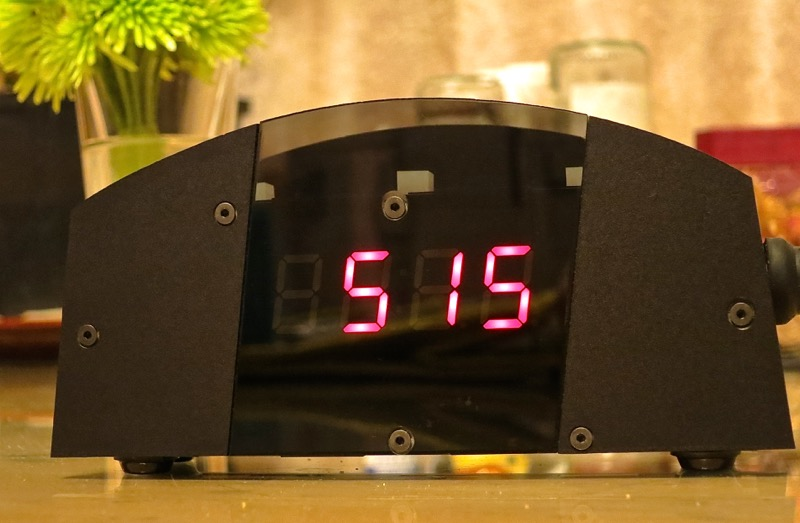
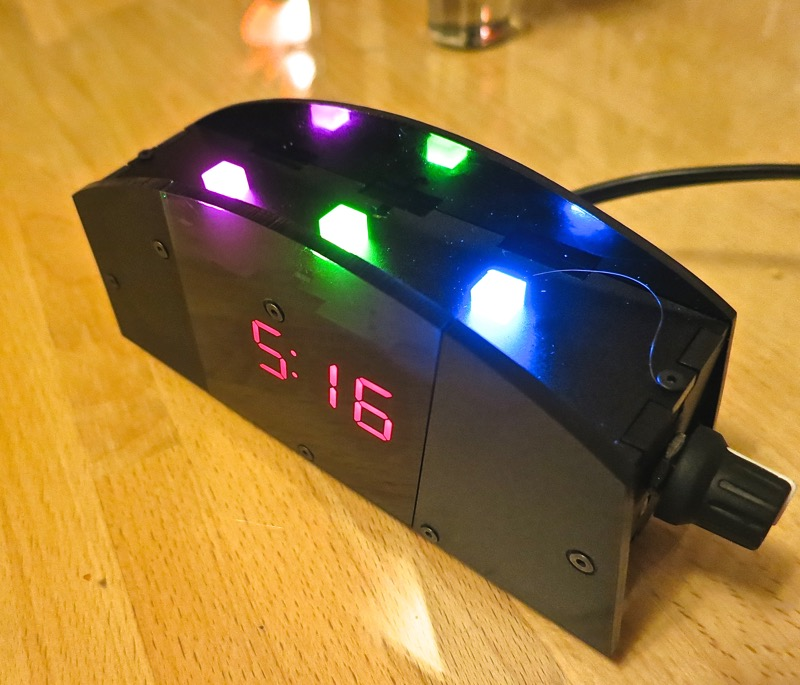

Just imagine, the

Digital Clock for your Bed
=========

with a rotary encoder knob (the type that also has  a button), and a strip of 3 neo pixels illuminating your mid-sleep bathroom trip in pretty colors! Now that's life.  

The clock is powered by Arduino-compatible, but much more powerful [Teensy 3.1](https://www.pjrc.com/teensy/teensy31.html). Yes, teensy is probably an overkill for this project, but it does provide some interesting options for reprogramming this clock in the future. There is a way to access Teensy's USB port, and so it is pretty easy to hook the clock to a computer running Arduino with an AVR build tool chain and update the source. This project folder maps to an Eclipse project, as I use Eclipse Arduino extension, retrofitted to work with Teensy.

Overview
=============

The clock is equipped with:

* light sensor (beneath the rotary knob) which automatically adjust brightness by up to 50% in either direction, depending on the light around (it is attached to a 10K resistor).
* rotary knob with a built-in button functionality
* 3 "neo pixel" RGB LEDs
* Adafruit 7-segment I2C display for the time display

The enclosure you see on the picture is made from 1/8" acrylic using matte black color, and semi-transparent black for the front panel.

Functionality
=============

When the switch turns on, the clock is on.  The time is stored on Teensy backed by a 3.3V battery, and uses a crystal soldered on the bottom of Teensy.

When the clock is running, you can:
* Press single click rotary knob turns on/off neo pixel strip
* Press double click rotary knob turns off/on 7-segment display
* moving rotary knob in this mode changes the brightness. There are 16 total values for brightness, from 0 to 15.
* press and hold enters the menu to set the time
  * Once in the menu setup, rotating the knob changes the current hour.  When done, click the knob once.
	  * If during either hour or minutes setup you rather cancel this process, double click the button.
  * Now change the minutes, and when ready click the knob once.
  * Now the time will be set and saved, and configuration mode is finished.
    
Libraries
=========
Supplied with Teensy:
* Wire
* DS1307RTC
* Adafruit_GFX
* Time

Additional dependencies:
* [LiquidCrystal_I2C](https://github.com/fdebrabander/Arduino-LiquidCrystal-I2C-library) (only needed for a debug LCD 4x20 screen, which can be disabled with a macro define)
* [Adafruit_LEDBackpack](https://github.com/adafruit/Adafruit-LED-Backpack-Library)
* [RotaryEncoderWithButton](https://github.com/kigster/kiguino/tree/master/arduino/libraries/RotaryEncoderWithButton)
* [OneButton](https://github.com/mathertel/OneButton)

Author
======

(c) 2015 Konstantin Gredeskoul, https://github.com/kigster

Distributed under MIT license, see [LICENSE](LICENSE).
